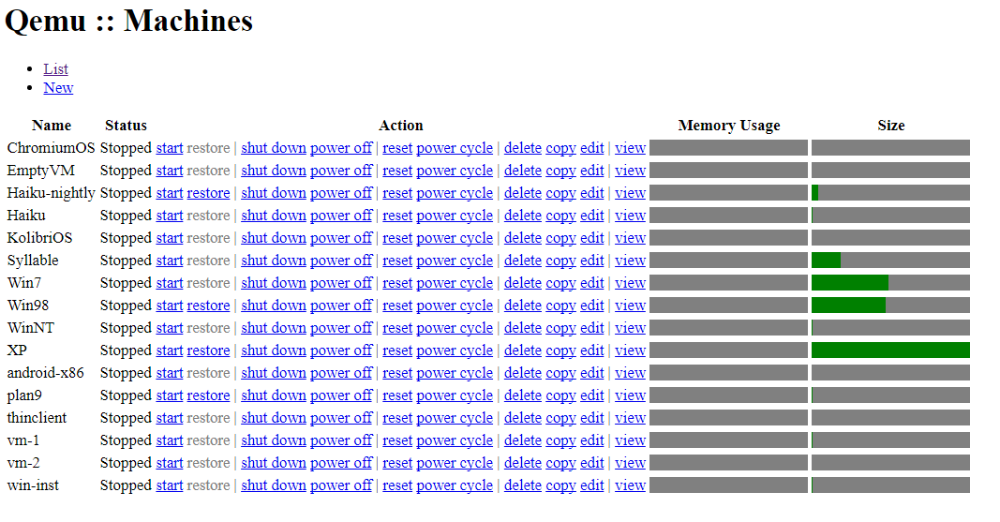
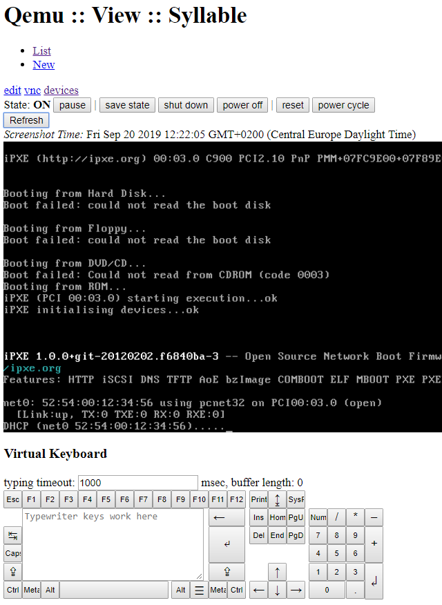
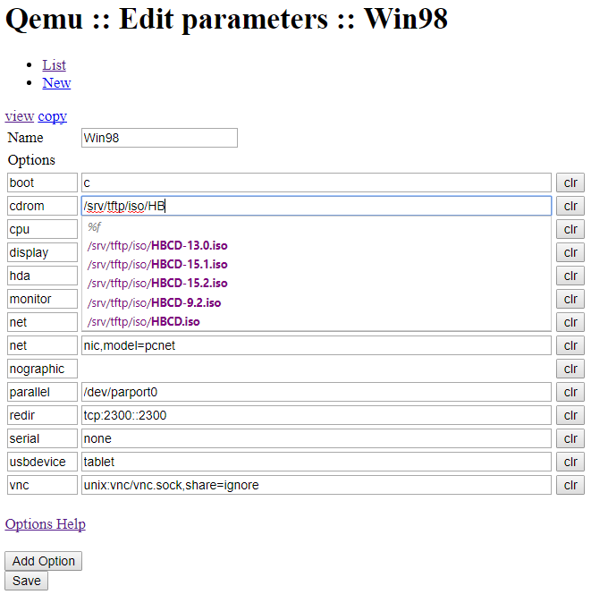
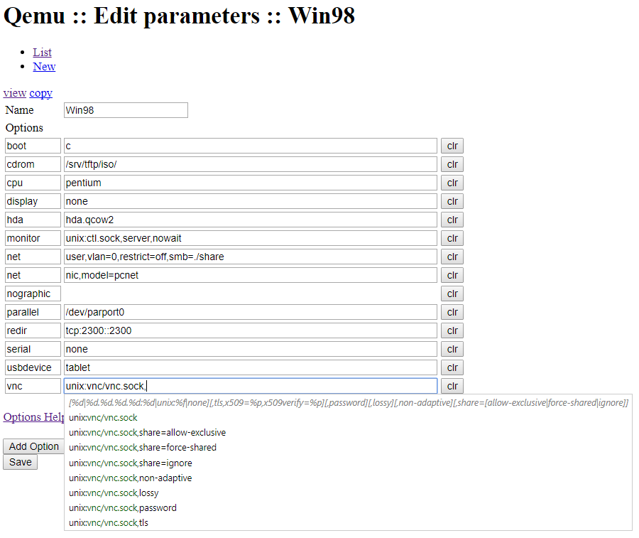
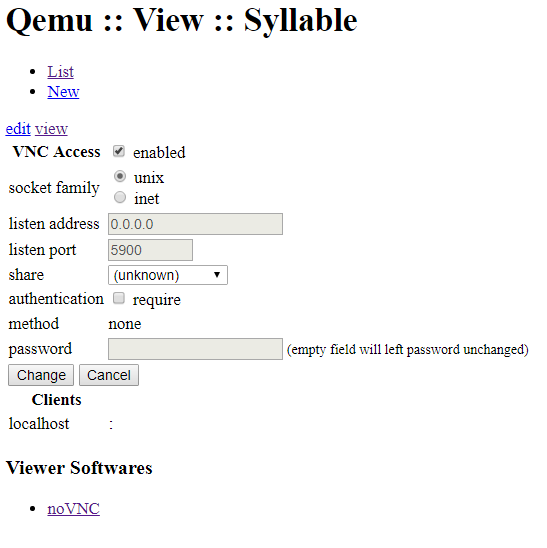
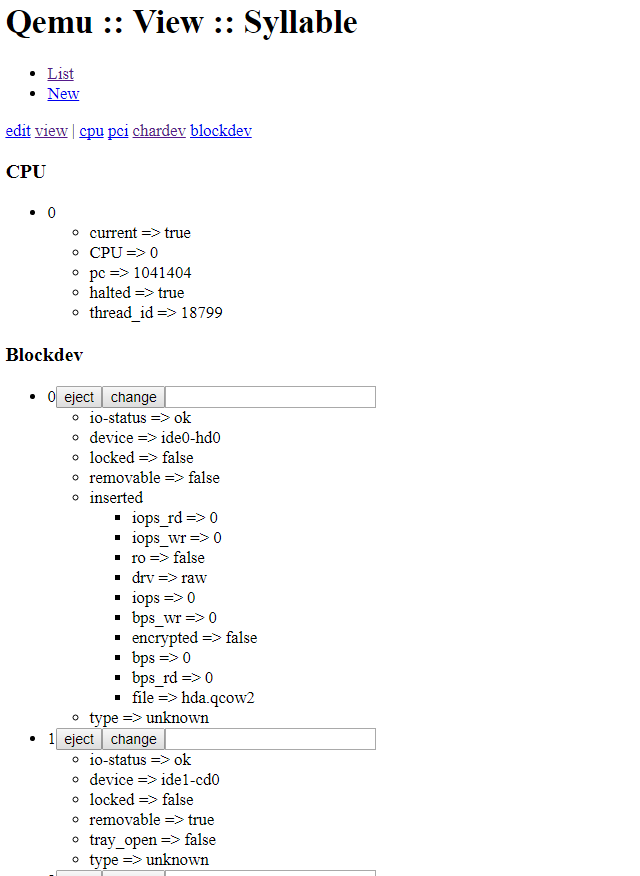

## Features

- manage several VM in a plain but well defined directory structure
- sophisticated auto-completion for configuration options and file paths
- has "kvm-console" ie. web-keyboard and screenshot which updates on your typing bursts and also tries to dispatch mouse clicks (it's difficult with relative virtual mouse devices, but works well with "tablet" v-mouse)
- integrated noVNC, so you can feel more realtime kvm-console experience (it requires nginx websocket module, but does not open tcp ports because communicates on unix domain sockets)
- save/restore VM, so you can hibernate your vm to the disk and restore as well
- no fancy css design yet, but templating is in place :)

## Screenshots

# issues
Please submit issues via PR to some file `issue/TITLE.txt`.
